# 个人工具台

个人工具台把常用服务入口、日历、时区、导入预览、声音设置、进制转换和加密小工具放在一个页面里，适合做自己的日常工作入口。

- 在线体验：[https://etng.github.io/tk/](https://etng.github.io/tk/)
- 使用帮助：打开页面后进入“设置 -> 使用帮助”

## Docker 自部署

如果想部署到自己的机器上，可以用 Docker Compose 同时启动静态站和本机 Docker 入口桥：

```bash
git clone https://github.com/etng/tk.git
cd tk
docker compose up -d
```

默认访问地址：

```text
http://127.0.0.1:8088/
```

然后打开“设置 -> 服务订阅”，添加：

```text
http://127.0.0.1:17321/v1/services
```

首次读取本机订阅时，浏览器可能会询问是否允许访问本机网络；选择允许后，服务页会自动合并 Docker 容器入口。

如果镜像发布在自己的 Docker Hub 命名空间，或需要换端口，可以这样启动：

```bash
DOCKERHUB_NAMESPACE=your-dockerhub-name \
TOOLKIT_HTTP_PORT=8090 \
docker compose up -d
```

如果用域名访问页面，请把域名加入桥服务允许来源：

```bash
TOOLKIT_HTTP_ADDR=0.0.0.0 \
TOOLKIT_ALLOWED_ORIGINS=https://tools.example.com \
docker compose up -d
```

## 页面切换


打开首页后，鼠标移到页面顶部会显示悬浮导航。这里可以切换到壁纸、服务、日历、时区、导入、设置和工具页面，也可以新建自己的服务看板。

## 功能导览

<a id="services"></a>
### 服务入口

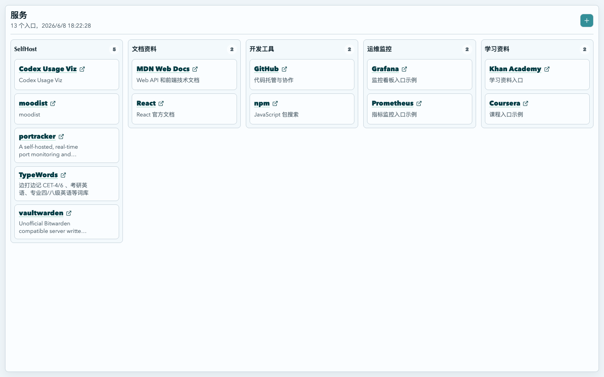

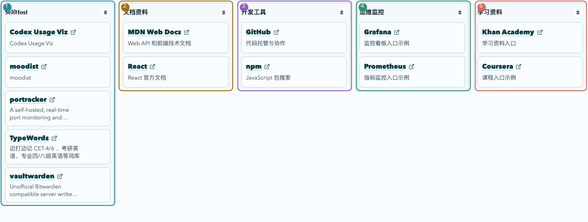

1. 服务入口按分类成列展示，可以移动到不同看板。
2. 自定义入口可以填写标题、地址和备注，方便把常用网页整理到自己的工作区。
3. 在设置页添加服务订阅地址后，服务页会自动合并订阅里的入口。

#### 本机 Docker 入口

如果本机 Docker 容器已经配置了 `homepage.*` labels，可以运行一个本机桥服务，把这些容器自动显示到服务入口里：

```bash
docker pull etng/tk-docker-service-bridge:latest
docker rm -f tooldkit-docker-service-bridge 2>/dev/null || true
docker run -d \
  --name tooldkit-docker-service-bridge \
  -p 127.0.0.1:17321:17321 \
  -v /var/run/docker.sock:/var/run/docker.sock:ro \
  etng/tk-docker-service-bridge:latest
```

然后打开“设置 -> 服务订阅”，添加：

```text
http://127.0.0.1:17321/v1/services
```

端口只发布到 `127.0.0.1`，页面会从浏览器本机读取这份订阅。首次读取时，浏览器可能会询问是否允许访问本机网络；选择允许后，服务入口会自动合并这些 Docker 入口。

<a id="calendar"></a>
### 日历

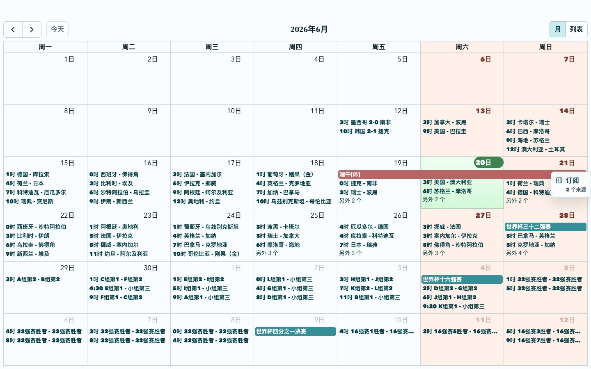

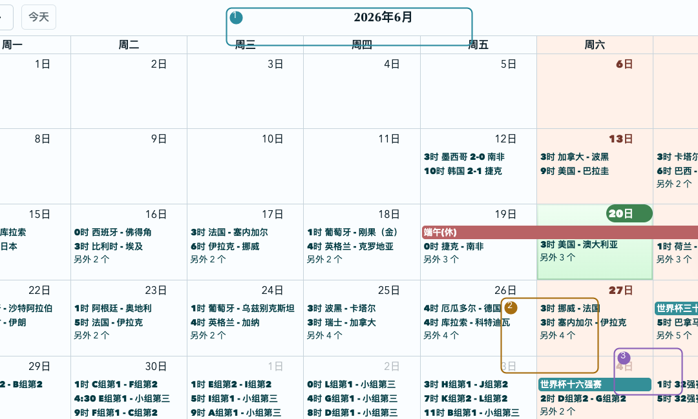

1. 日历支持月视图和列表视图，内置中国节假日、世界杯 2026 和特殊日期事件。
2. 周末、节假日和普通订阅事件使用不同颜色区分。
3. 自定义事件支持链接、颜色、图标和备注，并可导出为标准 ICS。

<a id="timezone"></a>
### 时区地图

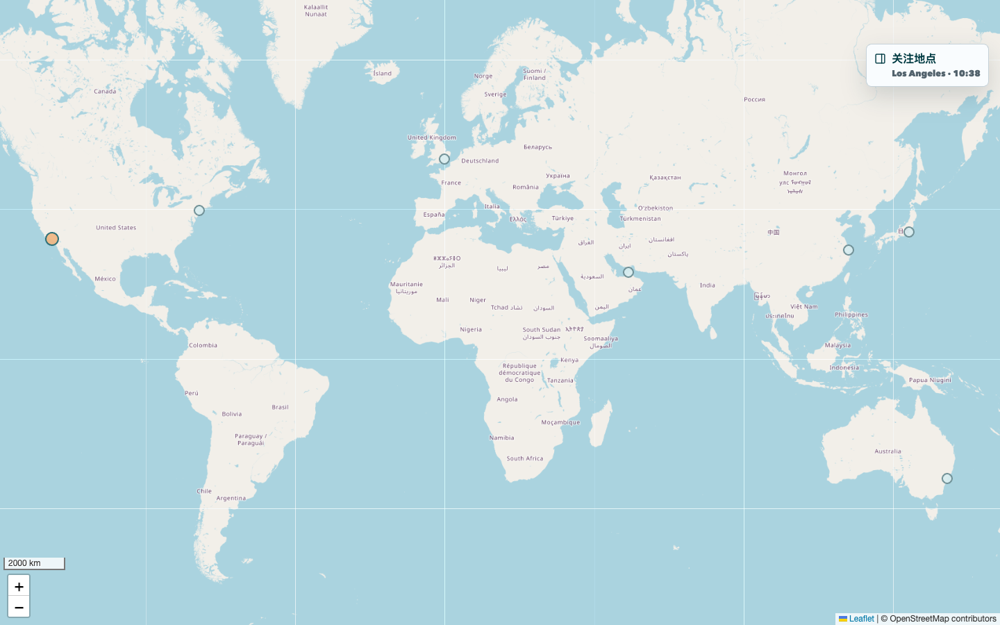

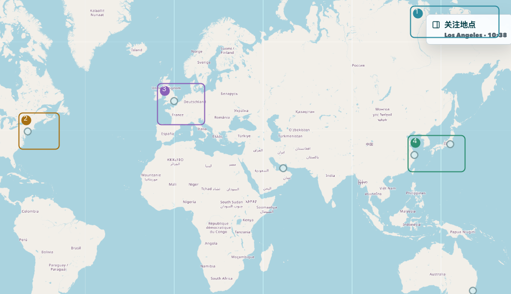

1. 地图默认全屏展示，右侧抽屉默认关闭，需要时再打开。
2. 内置主要城市经纬度和 IANA 时区，可以添加长期关注地点并查看当地当前时间。

<a id="import-preview"></a>
### 导入预览

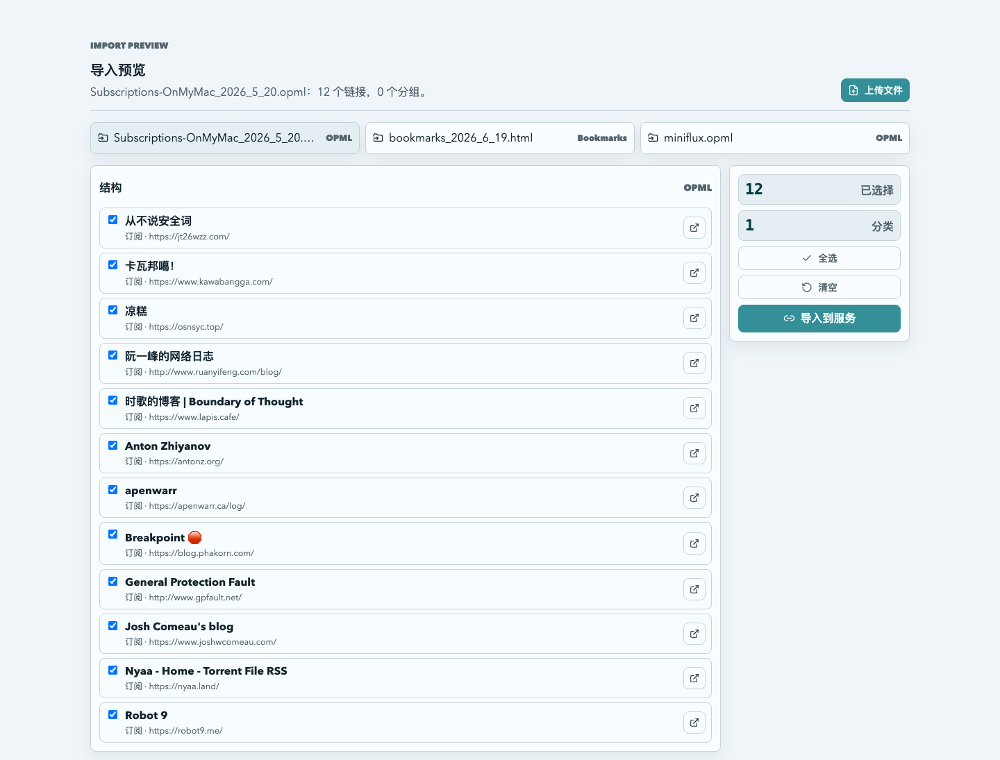

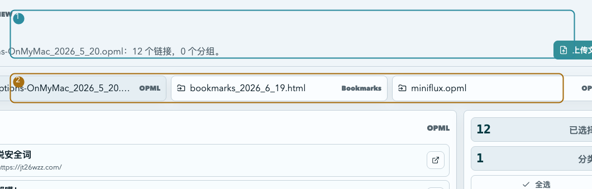

1. OPML 和浏览器书签文件会先进入预览页，不会直接写入服务入口。
2. 链接旁边的外链图标可以先打开确认。
3. 导入到服务页时会保留分类结构，并跳过已经存在的链接。

<a id="remote-backup"></a>
### 远端加密备份

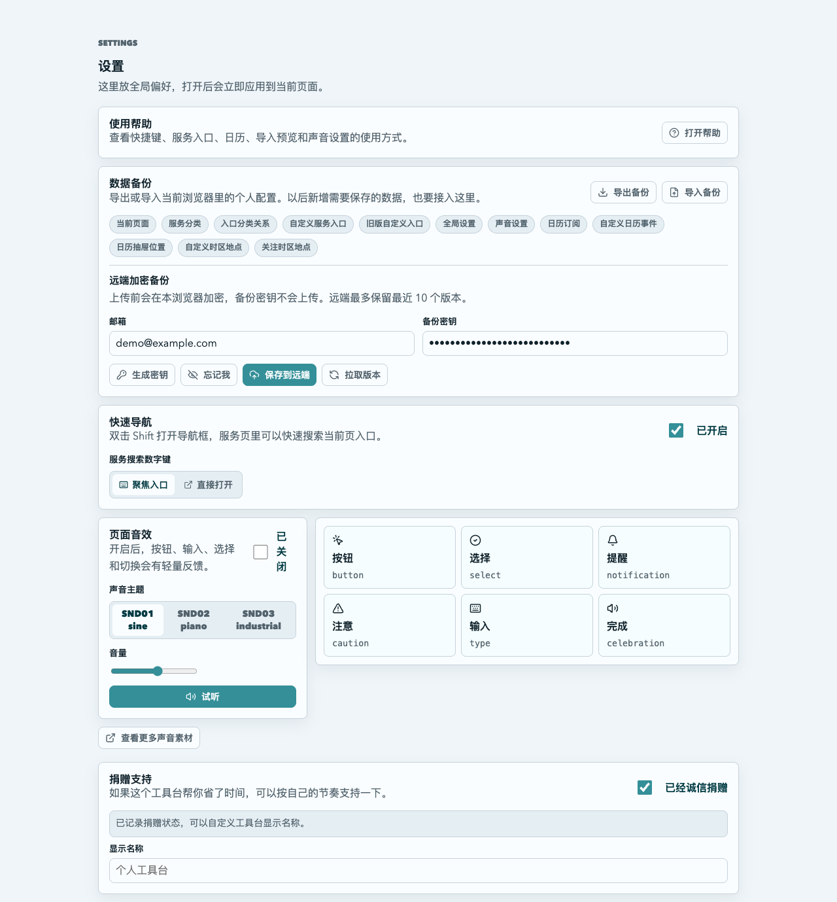

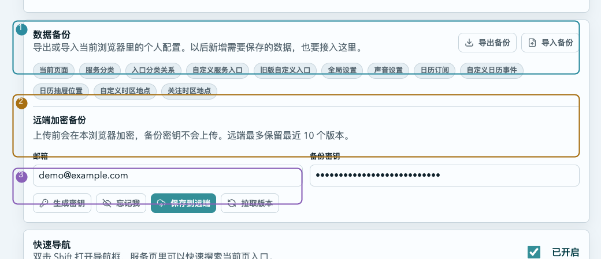

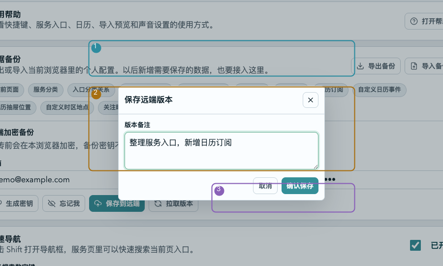

1. 邮箱和备份密钥只会保存在当前浏览器会话里，浏览器重启前可继续使用。
2. 点击“忘记我”会清掉本次会话中的邮箱和备份密钥。
3. 点击“保存到远端”后会弹出版本备注窗口；备份内容和备注都会先在浏览器里加密。

<a id="quick-nav"></a>
### 快速导航

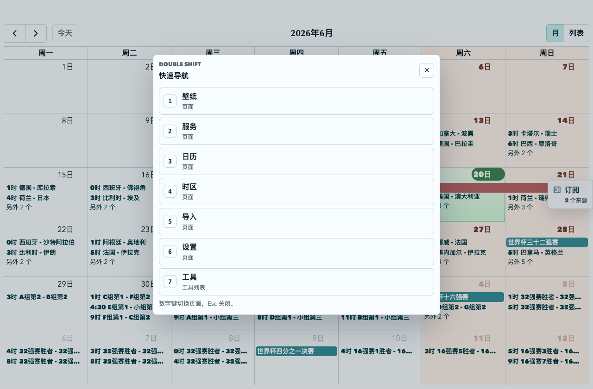

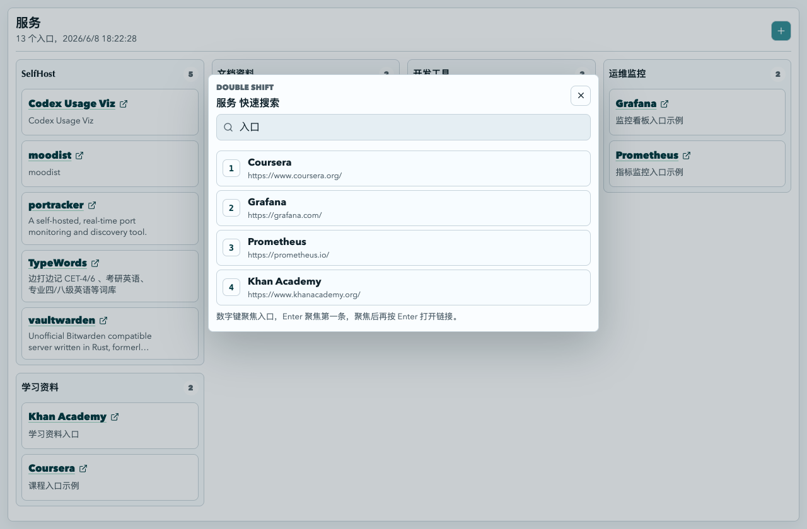

1. 在非输入状态下双击 `Shift` 可以打开快速导航。
2. 普通页面会显示页面列表，按数字键直接切换。
3. 服务页会显示搜索框，按标题、地址和备注匹配入口；数字键默认聚焦命中的链接，聚焦后按 `Enter` 打开。

<a id="sound-settings"></a>
### 声音设置


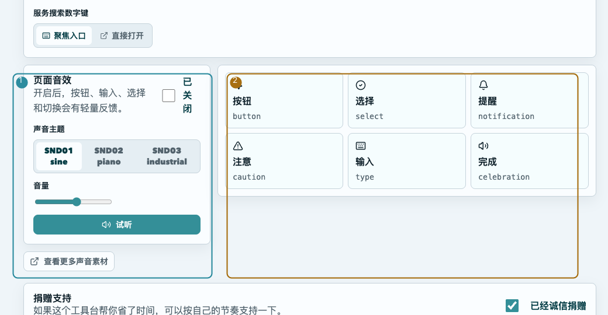

1. 设置页可以开启页面音效、调整音量，并在三套声音主题之间切换。
2. 右侧试听区可以直接预览按钮、选择、提醒、注意、输入和完成等事件音效。

<a id="tools"></a>
### 工具箱

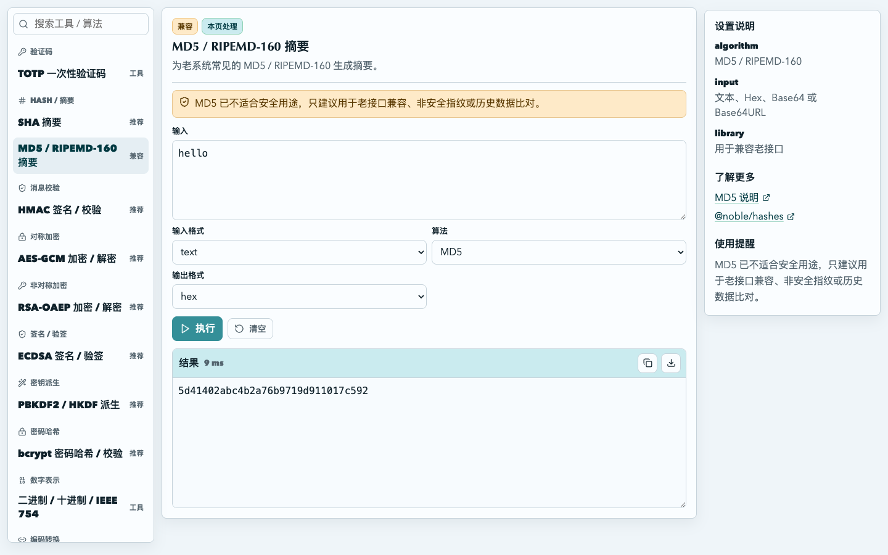

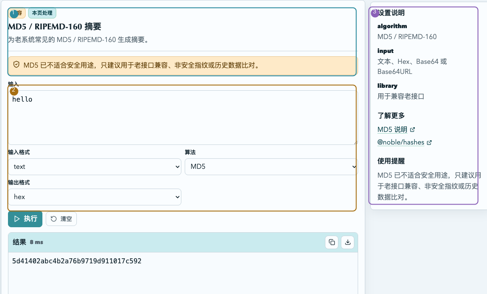

1. 工具页左侧按用途列出常用小工具，适合临时处理文本、摘要、编码和密钥数据。
2. 选择一个工具后，只需要填写输入和参数；例如 MD5 / RIPEMD-160 摘要可以直接生成兼容老系统的指纹。

## 数据与隐私

- 工具输入默认在浏览器本地处理。
- 本地配置、服务入口、日历订阅、自定义事件、时区关注地点、声音设置等可以从设置页导出和导入。
- 远端备份会在浏览器里加密后再上传，服务端只保存密文版本，不保存备份密钥。
- 在线版本只需要浏览器即可访问。涉及个人内容的配置请自行导出保存，或使用远端加密备份。
